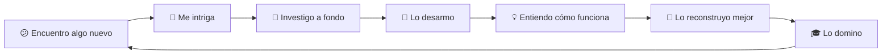

<div align="center">

# Andy Jhoe Palma Erazo


[](https://git.io/typing-svg)

<!--
BANNER/GIF PRINCIPAL
Para cambiar la imagen, reemplaza la URL después de src=
width=800 controla el ancho de la imagen
-->


</div>

---

## 🚀 Sobre Mí

```python
class PerfilDesarrollador:
    def __init__(self):
        self.name = "Andy Jhoe Palma Erazo"
        self.username = "Jhoe24"
        self.location = "Barinas, Venezuela"
        self.role = "Universitario"
        self.passion = "Python"

    def Filosofia(self):
        return """
        Si no entiendo algo completamente, lo desarmo hasta sus
        componentes más básicos. No me importa si después no funciona,
        porque en el proceso aprendo cómo funciona realmente.

        El conocimiento se construye desde la raíz, no importa los 
        fallos que te encuentres.
        """

    def enfoque_actual(self):
        return [
            "Aprendiendo Flutter para aplicaciones móviles y web",
            "Construyendo aplicaciones de escritorio con Electron",
            "Profundizando en React para interfaces reactivas"
        ]

    def lema(self):
        return "romperlo() → aprenderlo() → reconstruirlo() → dominarlo()"
```

<div align="center">

### 🎯 Filosofía de Código

> _"El universo está en constante expansión..._  
> _...al igual que mi curiosidad"_ 

</div>

---

## 💻 Stack Tecnológico

<div align="center">
<div align="center">

| Lenguajes | Frameworks & Librerías | Bases de Datos & Herramientas |
|---:|:---:|:---|
|  <br>  <br>  <br>  |  <br>  <br>  <br>  |  <br>  <br>  <br>  <br>  |


</div>

---

## 🌌 Más Allá del Código

<div align="center">

<!-- PUEDES CAMBIAR ESTE GIF POR OTRO QUE TE GUSTE -->


</div>


### 💭 Mi Proceso de Aprendizaje

<div align="center">



</div>

---

## 📈 Actividad de Contribución

<div align="center">


[](https://github.com/ashutosh00710/github-readme-activity-graph)

</div>

---

<div align="center">

### 💬 Filosofía de Vida

<!-- CAMBIA AQUÍ TU FRASE FINAL -->

> **"El código es poesía, los bugs son lecciones,**  
> **y cada proyecto es un nuevo universo por explorar."** ✨

<!-- GIF DE CIERRE - PUEDES CAMBIARLO -->


### 🌟 Gracias por visitar mi perfil

<!-- CONTADOR DE VISITAS - Reemplaza "Jhoe24" con TU username -->


---

<!-- IMAGEN FINAL DEL FOOTER -->


</div>

# <!--

# FIN DEL PERFIL

RECURSOS ÚTILES PARA PERSONALIZAR:

📌 Badges/Insignias:

- https://shields.io/
- https://github.com/Ileriayo/markdown-badges

🎨 GIFs y animaciones:

- https://github.com/Anmol-Baranwal/Cool-GIFs-For-GitHub
- https://user-images.githubusercontent.com/

📊 Estadísticas de GitHub:

- https://github.com/anuraghazra/github-readme-stats
- https://github.com/DenverCoder1/github-readme-streak-stats

🎵 Spotify Widget:

- https://github.com/kittinan/spotify-github-profile

💡 TIPS DE EDICIÓN:

1.  Para buscar y reemplazar tu username: Ctrl+F → busca "Jhoe24" → reemplaza con tu username
2.  Para cambiar colores: busca códigos como "4FC3F7" y cámbialos
3.  Para agregar emojis: Windows (Win + .) | Mac (Cmd + Ctrl + Espacio)
4.  Siempre guarda una copia de respaldo antes de hacer cambios grandes

# ¡ÉXITO CON TU PERFIL! 🚀

-->
