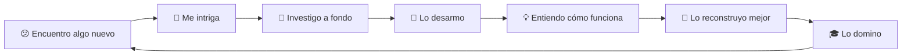

<div align="center">

# 🌌 Andy Jhoe Palma Erazo

[](https://git.io/typing-svg)


</div>

---

## 🚀 Sobre Mí

```python
class DeveloperProfile:
    def __init__(self):
        self.name = "Andy Jhoe Palma Erazo"
        self.username = "Jhoe24"
        self.location = "Barinas, Venezuela 🇻🇪"
        self.role = "Estudiante Universitario"
        self.passion = "Python & Tecnología"
        
    def philosophy(self):
        return """
        Si no entiendo algo completamente, lo desarmo hasta sus 
        componentes más básicos. No me importa si después no funciona,
        porque en el proceso aprendo cómo funciona realmente.
        
        El conocimiento se construye desde la raíz. 🌱
        """
    
    def current_focus(self):
        return [
            "🐍 Dominando Python y sus ecosistemas",
            "🎨 Creando interfaces modernas y elegantes",
            "🤖 Experimentando con Arduino y hardware",
            "📚 Leyendo documentación como si fueran novelas",
            "🌌 Explorando el universo del código"
        ]
    
    def life_motto(self):
        return "break_it() → learn_it() → rebuild_it() → master_it()"
```

<div align="center">

### 🎯 Filosofía de Código

> *"El universo está en constante expansión...*  
> *...al igual que mi curiosidad"* 🌠

</div>

---

## 💻 Stack Tecnológico

<div align="center">

### 🔥 Lenguajes


### ⚡ Frameworks & Librerías


### 🗄️ Bases de Datos


### 🛠️ Herramientas & Otros


</div>

---

## 📊 Estadísticas de GitHub

<div align="center">
  


</div>

<div align="center">

[](https://git.io/streak-stats)

</div>

<div align="center">

### 🏆 Logros de GitHub

[](https://github.com/ryo-ma/github-profile-trophy)

</div>

---

## 🎨 Proyectos Destacados

<div align="center">

<table>
<tr>
<td width="50%">
<h3 align="center">Proyecto 1</h3>
<div align="center">
<a href="https://github.com/Jhoe24/proyecto-1" target="_blank">

</a>
<p>
<a href="https://github.com/Jhoe24/proyecto-1" target="_blank">

</a>
</p>
<p><strong>Python, Arduino</strong> - Descripción breve del proyecto y su impacto</p>
</div>
</td>

<td width="50%">
<h3 align="center">Proyecto 2</h3>
<div align="center">
<a href="https://github.com/Jhoe24/proyecto-2" target="_blank">

</a>
<p>
<a href="https://github.com/Jhoe24/proyecto-2" target="_blank">

</a>
</p>
<p><strong>React, Vite</strong> - Descripción breve del proyecto y su impacto</p>
</div>
</td>
</tr>

<tr>
<td width="50%">
<h3 align="center">Proyecto 3</h3>
<div align="center">
<a href="https://github.com/Jhoe24/proyecto-3" target="_blank">

</a>
<p>
<a href="https://github.com/Jhoe24/proyecto-3" target="_blank">

</a>
</p>
<p><strong>Python, PostgreSQL</strong> - Descripción breve del proyecto y su impacto</p>
</div>
</td>

<td width="50%">
<h3 align="center">Proyecto 4</h3>
<div align="center">
<a href="https://github.com/Jhoe24/proyecto-4" target="_blank">

</a>
<p>
<a href="https://github.com/Jhoe24/proyecto-4" target="_blank">

</a>
</p>
<p><strong>Electron, JavaScript</strong> - Descripción breve del proyecto y su impacto</p>
</div>
</td>
</tr>
</table>

</div>

---

## 🌌 Más Allá del Código

<div align="center">


</div>

### 🎯 Intereses y Pasiones

```javascript
const myInterests = {
    🎵 música: "Cada bug tiene su banda sonora perfecta",
    🤖 hardware: "Arduino, electrónica y proyectos que a veces explotan",
    🌌 universo: "Física cuántica, multiversos y teorías cósmicas",
    📚 aprendizaje: "Leo documentación técnica como novelas",
    🎨 anime: "Porque la animación también es arte",
    🔧 tinkering: "Si funciona, lo desarmo. Si no funciona, también."
};
```

### 💭 Mi Proceso de Aprendizaje

<div align="center">



</div>

---

## 📈 Actividad de Contribución

<div align="center">

[](https://github.com/ashutosh00710/github-readme-activity-graph)

</div>

---

## 🎵 Actualmente Escuchando

<div align="center">

[](https://spotify-github-profile.vercel.app/api/view?uid=TU_ID_DE_SPOTIFY&redirect=true)

</div>

---

<div align="center">

### 💬 Filosofía de Vida

> **"El código es poesía, los bugs son lecciones,**  
> **y cada proyecto es un nuevo universo por explorar."** ✨


### 🌟 Gracias por visitar mi perfil


---


</div>