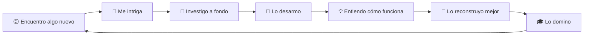

<!-- 
===========================================
   PERFIL DE GITHUB - JHOE24
   Creado para: Andy Jhoe Palma Erazo
===========================================
-->

<!-- 
===========================================
SECCIÓN 1: ENCABEZADO PRINCIPAL
===========================================
Aquí puedes modificar:
- Tu nombre
- El tamaño del texto animado
- Los textos que aparecen animados
- El tamaño del banner
-->

<div align="center">

<!-- Tu nombre principal -->
# 🌌 Andy Jhoe Palma Erazo

<!-- 
TEXTO ANIMADO
Para modificar:
- size=32 → Cambia el tamaño del texto (prueba con 28, 36, 40)
- width=900 → Cambia el ancho (prueba con 800, 1000)
- height=120 → Cambia la altura (prueba con 100, 140)
- lines=Texto1;Texto2;Texto3 → Cambia las líneas que aparecen (separa con ;)
-->
[](https://git.io/typing-svg)

<!-- 
BANNER/GIF PRINCIPAL
Para cambiar la imagen, reemplaza la URL después de src=
width=800 controla el ancho de la imagen
-->


</div>

---

<!-- 
===========================================
SECCIÓN 2: SOBRE MÍ (CÓDIGO PYTHON)
===========================================
Modifica el contenido dentro de las comillas para cambiar tu información
-->

## 🚀 Sobre Mí

```python
class DeveloperProfile:
    def __init__(self):
        # CAMBIA AQUÍ TU INFORMACIÓN PERSONAL
        self.name = "Andy Jhoe Palma Erazo"
        self.username = "Jhoe24"
        self.location = "Barinas, Venezuela 🇻🇪"
        self.role = "Estudiante Universitario"
        self.passion = "Python & Tecnología"
        
    def philosophy(self):
        # CAMBIA AQUÍ TU FILOSOFÍA
        return """
        Si no entiendo algo completamente, lo desarmo hasta sus 
        componentes más básicos. No me importa si después no funciona,
        porque en el proceso aprendo cómo funciona realmente.
        
        El conocimiento se construye desde la raíz. 🌱
        """
    
    def current_focus(self):
        # CAMBIA AQUÍ EN QUÉ ESTÁS TRABAJANDO ACTUALMENTE
        return [
            "🐍 Dominando Python y sus ecosistemas",
            "🎨 Creando interfaces modernas y elegantes",
            "🤖 Experimentando con Arduino y hardware",
            "📚 Leyendo documentación como si fueran novelas",
            "🌌 Explorando el universo del código"
        ]
    
    def life_motto(self):
        # CAMBIA AQUÍ TU LEMA DE VIDA
        return "break_it() → learn_it() → rebuild_it() → master_it()"
```

<div align="center">

### 🎯 Filosofía de Código

<!-- CAMBIA AQUÍ TU FRASE MOTIVACIONAL -->
> *"El universo está en constante expansión...*  
> *...al igual que mi curiosidad"* 🌠

</div>

---

<!-- 
===========================================
SECCIÓN 3: STACK TECNOLÓGICO
===========================================
Para agregar un nuevo badge:
1. Visita: https://shields.io/badges
2. O busca en: https://github.com/Ileriayo/markdown-badges
3. Copia el código del badge y pégalo aquí

Formato de un badge:


Para eliminar un badge, simplemente borra la línea completa
-->

## 💻 Stack Tecnológico

<div align="center">

### 🔥 Lenguajes

<!-- AGREGA O ELIMINA LENGUAJES AQUÍ -->


### ⚡ Frameworks & Librerías

<!-- AGREGA O ELIMINA FRAMEWORKS AQUÍ -->


### 🗄️ Bases de Datos

<!-- AGREGA O ELIMINA BASES DE DATOS AQUÍ -->


### 🛠️ Herramientas & Otros

<!-- AGREGA O ELIMINA HERRAMIENTAS AQUÍ -->


</div>

---

<!-- 
===========================================
SECCIÓN 4: ESTADÍSTICAS DE GITHUB
===========================================
IMPORTANTE: Reemplaza "Jhoe24" con tu username de GitHub en todas las URLs

Para personalizar:
- height=200 → Cambia la altura de las gráficas
- theme=tokyonight → Cambia el tema (prueba: dracula, radical, merko, gruvbox, dark)
- hide_border=true → Cambia a false para mostrar bordes
- bg_color=0D1117 → Cambia el color de fondo (formato hexadecimal sin #)
- title_color=4FC3F7 → Cambia el color de los títulos
-->


---

<!-- 
===========================================
SECCIÓN 6: MÁS ALLÁ DEL CÓDIGO
===========================================
Personaliza tus intereses y pasiones aquí
-->

## 🌌 Más Allá del Código

<div align="center">

<!-- PUEDES CAMBIAR ESTE GIF POR OTRO QUE TE GUSTE -->


</div>

### 🎯 Intereses y Pasiones

```javascript
// MODIFICA TUS INTERESES AQUÍ
const myInterests = {
    🎵 música: "Cada bug tiene su banda sonora perfecta",
    🤖 hardware: "Arduino, electrónica y proyectos que a veces explotan",
    🌌 universo: "Física cuántica, multiversos y teorías cósmicas",
    📚 aprendizaje: "Leo documentación técnica como novelas",
    🎨 anime: "Porque la animación también es arte",
    🔧 tinkering: "Si funciona, lo desarmo. Si no funciona, también."
};
```

### 💭 Mi Proceso de Aprendizaje

<div align="center">

<!-- 
DIAGRAMA MERMAID
Para modificar el flujo, edita el texto entre las líneas
Formato: A[Texto] --> B[Texto]
-->


</div>

---

<!-- 
===========================================
SECCIÓN 7: GRÁFICO DE ACTIVIDAD
===========================================
Reemplaza "Jhoe24" con tu username
-->

## 📈 Actividad de Contribución

<div align="center">

<!-- CAMBIA "Jhoe24" POR TU USERNAME -->
[](https://github.com/ashutosh00710/github-readme-activity-graph)

</div>

---

<!-- 
===========================================
SECCIÓN 8: SPOTIFY (OPCIONAL)
===========================================
Para habilitar:
1. Ve a: https://spotify-github-profile.vercel.app/api/login
2. Autoriza con tu cuenta de Spotify
3. Copia tu Spotify User ID
4. Reemplaza "TU_SPOTIFY_USER_ID" con tu ID
5. Elimina los símbolos de comentario (quita el  y el ->)
-->

<!-- 
## 🎵 Actualmente Escuchando

<div align="center">

<a href="https://spotify-github-profile.vercel.app/api/view?uid=TU_SPOTIFY_USER_ID&redirect=true">
  
</a>

</div>

---
-->

<!-- 
===========================================
SECCIÓN 9: PIE DE PÁGINA
===========================================
-->

<div align="center">

### 💬 Filosofía de Vida

<!-- CAMBIA AQUÍ TU FRASE FINAL -->
> **"El código es poesía, los bugs son lecciones,**  
> **y cada proyecto es un nuevo universo por explorar."** ✨

<!-- GIF DE CIERRE - PUEDES CAMBIARLO -->


### 🌟 Gracias por visitar mi perfil

<!-- CONTADOR DE VISITAS - Reemplaza "Jhoe24" con TU username -->


---

<!-- IMAGEN FINAL DEL FOOTER -->


</div>

<!-- 
===========================================
FIN DEL PERFIL
===========================================

RECURSOS ÚTILES PARA PERSONALIZAR:

📌 Badges/Insignias:
   - https://shields.io/
   - https://github.com/Ileriayo/markdown-badges

🎨 GIFs y animaciones:
   - https://github.com/Anmol-Baranwal/Cool-GIFs-For-GitHub
   - https://user-images.githubusercontent.com/

📊 Estadísticas de GitHub:
   - https://github.com/anuraghazra/github-readme-stats
   - https://github.com/DenverCoder1/github-readme-streak-stats

🎵 Spotify Widget:
   - https://github.com/kittinan/spotify-github-profile

💡 TIPS DE EDICIÓN:
   1. Para buscar y reemplazar tu username: Ctrl+F → busca "Jhoe24" → reemplaza con tu username
   2. Para cambiar colores: busca códigos como "4FC3F7" y cámbialos
   3. Para agregar emojis: Windows (Win + .) | Mac (Cmd + Ctrl + Espacio)
   4. Siempre guarda una copia de respaldo antes de hacer cambios grandes

¡ÉXITO CON TU PERFIL! 🚀
===========================================
-->